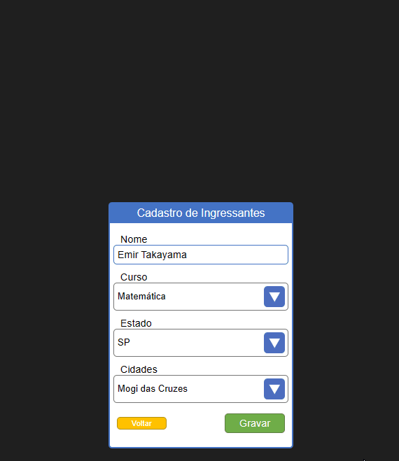

# Desafio Técnico de React da Muralis
 [Detalhe do desafio neste PDF 🔗](D01_REACT_BASICO_V01_04072022.pdf)

## Como foi feito o projeto
O projeto foi criado utilizando `npx create-react-app desafiomuralis`.

### Alguns pontos sobre o projeto
- O projeto pode ser acessado por este site : [🔗https://desafiomuralis.vercel.app/🔗](https://desafiomuralis.vercel.app/)

- Foi separado em 2 pastas, pages e components para simular que o componente está dentro da página por meio de componentização

- Os dados da lista de Cursos, Estados e Cidade está separado, para simular uma requisição por meio externo.

- Gif para demonstração do botão voltar e gravar funcionando

## Desenvolvedor
 <a href="https://github.com/ngemir">
 

 
 Emir Takayama
 

</a>
